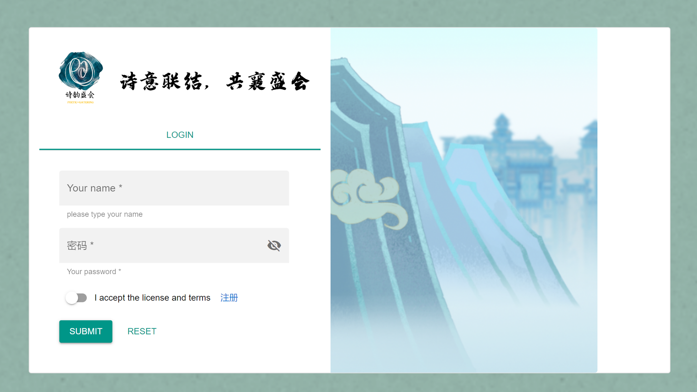

  <picture>
  
  </picture>
   
   

    
    

<h3 align="center">
    
致力于促进诗词文化传承与交流的在线平台

</h3>

🌟 诗韵盛会（PoeticGathering）是一个致力于促进诗词文化传承与交流的在线平台。我们提供了多种功能，包括1v1诗词知识比拼、观众旁观多人在线互动、人工智能NPC互动以及个人学习总结等，让用户能够在这个平台上畅享诗意的魅力，共襄盛会。

📖 在诗韵盛会，用户可以挑战他人进行1v1的诗词知识比拼。通过答题竞赛的方式，展现自己的诗词造诣，与他人切磋交流，共同提高。

👩 除了参与比拼，用户还可以作为观众旁观其他用户之间的比拼。通过观看他人的比拼，学习他人的策略和技巧，丰富自己的诗词知识。

🤖️ 平台提供了智能NPC，用户可以与之进行互动。这些NPC具备丰富的诗词知识和交流技巧，可以模拟真实的人类对话，为用户提供更加真实和丰富的体验。

📝 在诗韵盛会，用户可以查看个人的学习总结。通过总结自己在比拼和观看中学到的知识和经验，不断提升自己的诗词水平，更好地参与到平台的活动中。

## 在线演示

你可以进入我们的主页[诗意联结](http://121.196.228.112:8888)，进行简单的注册登录后，便可以开始你的诗词学习之旅。祝你拥有一段愉快的时光！✨

## 快速上手
- 注册登录
  
  > 输入用户名密码，并选择自己的虚拟3d形象。

  
  > 通过注册的用户名密码进行登录。

- 访问主页
  
  
  > 登录后进入主页，可以通过页面下方的左右键切换房间，不同的房间具有不同布景。用户可以选择作为参赛者`参赛`，或是作为观众`观赛`，两种方式进入房间有不同的流程。
  此外，用户还可以点击右下方的`查看学习报告`对自己的诗词学习进行回顾。

- 单击**参赛**进入房间
  
  
  

    
    
  

  > 用户选择参赛进入房间，按 `1` 进入准备状态，按 `2` 退出准备状态，一轮比赛结束后按 `3` 重新开启一场比赛。  
  比赛未开始时时按`0`可以退出，跳转到主页。  
  按下 `a`, `b`, `c`, `d` 表示题目选项。  
  按下 `上下左右` 键进行移动，按下 `空格` 键表示跳跃。 
  当两名用户进入同一房间并都准备好后，比赛就会倒计时5s开始。比赛采用抢答规则，答题的正确与否会被记录到用户的个性化学习记录中。每道题倒计时15s，答满三题后比赛结束，参赛者可以选择退出或继续比赛。
  房间内已有两人参赛时，其他用户不能再选择在该房间参赛。

- 单击**观赛**进入房间
  - ai智能交流
    

    
    
    

    > 走近房间左侧npc，可以选择按下 `n`键进行交流，在输入框内输入内容并按`Enter`发出，便可以得到接入Kimi的螺丝咕姆的回应。按下 `上下左右` 键可以退出交流。

  - 为参赛者献花
    

    
    
    

    
    > 走近房间右侧npc，可以选择按下 `m`键向阮·梅买花，在走到房间指定位置，按下 `x`键向对应参赛者献花（右侧为p1，左侧为p2）。随机样式的花会出现在该参赛者附近区域。

  - 与其他观赛者交流
    > 与同一房间的观赛者距离足够接近时，也可以选择向对方交谈。操作方式同与npc交流。

  - 音视频交流
    > 点击页面右上角的`加入音视频通讯`，即可以加入与同房间内其他用户的音视频交流。视频流会显示在右上角。

- 查看学习报告
  
  > 报告通过可视化图表展示了胜率、在线时长等数据，以及根据用户的复习频率进行错题的个性化推荐，并且接入AI智能分析功能，辅助错题复习。

