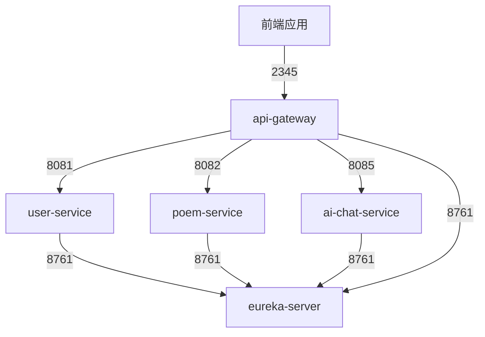

# 项目设计文档
## 1. 项目概述
诗韵盛会是一个致力于促进诗词文化传承与交流的在线平台，采用了前后端分离的架构。前端基于Vue.js构建，并结合Vuex进行状态管理，使用Quasar组件库打造现代化的用户界面，通过Axios与后端进行通信，并使用WebSocket实现实时互动；后端使用Spring Boot框架，结合Spring MVC构建RESTful API，使用Spring Data JPA与MySQL进行数据交互。为了确保开发环境和生产环境的一致性以及高效的部署，平台采用了Docker进行容器化管理。

## 2. 功能项表
| 功能项       | 评分指标                     | 完成情况 |
| --------- | ------------------------ | ---- |
| **基本功能**  |                          |      |
| UI和交互     | UI设计合理，具有较好的用户体验         | ✅    |
| 基本页面与流程   | 登录和注册功能使用正常              | ✅    |
|           | 后端用户管理功能                 | ✅    |
| 虚拟场景以及交互  | 可交互的3D场景建模合理，用户体验好       | ✅    |
|           | 场景功能的完成度和交互的丰富程度         | ✅    |
|           | 支持多人加入该场景，并实现行为共享        | ✅    |
|           | 支持用户间的文本、动作等方式交流         | ✅    |
| 工程能力      | 文档说明清晰、详细，图文并茂，图示准确      | ✅    |
|           | 系统架构设计合理规范               | ✅    |
|           | 代码清晰，风格合理，具有良好的设计模式      | ✅    |
|           | 服务部署在云平台上，具有很好的可访问性      | ✅    |
| **进阶功能**  |                          |      |
| AI能力      | 响应用户虚拟行为的智能导师            | ✅    |
| 语义Web         | 虚拟场景中的实体添加语义描述           | ✅    |
| 交互性       | 创新交互与多模式交流支持（如WebRTC）    | ✅    |
| 云计算应用 |  合理采用 Docker 以及多种云服务 | ✅    |
| 微服务    | 对项目进行微服务拆分        | ✅    |
| 用户个性化统计信息 | 多维度展现用户的学习情况，同时引入错题分析与推荐 | ✅    |
| 用户体验优化    | 进度条加载 | ✅    |
|		|不同人物的待机动作展示            | ✅    |
|		|设置不同的主题房间  |✅    |


## 3.  项目组织文件说明
```
.
├── poem-learning-platform  # 前端
└── poetryconference-parent # 后端
    ├── ai-chat-service
    ├── api-gateway
    ├── eureka-server
    ├── poem-service
    └── user-service
```
### 3.2 前端部分
```
├── App.vue
├── assets # 前端呈现所需资源
│   ├── animation # 动画
│   ├── img # 图片
│   ├── model # 模型
│   ├── owl # 语义描述
│   └── textures # 3D场景图片
├── fonts # 字体
├── main.js
├── quasar-variables.sass
├── router # 前端路由
│   └── index.js
├── scripts
│   ├── communications.js
│   ├── font.js # 导入字体
│   ├── loader.js # 导入模型和动画
│   ├── physics.js # 碰撞检测，物理引擎
│   ├── player.js # 玩家
│   ├── rng.js # 生成随机序列
│   ├── screen.js # 在3D屏幕上显示相关内容
│   ├── simplepeer.min.js 
│   ├── ui.js # 便于编写时调试的ui
│   ├── webrtc.js # webrtc
│   ├── world.js # 大世界
│   └── worldChunk.js # 大世界中的块
├── store
│   └── index.js # Vuex的store配置文件
└── views
    ├── LoginPage.vue
    ├── MainPage.vue
    ├── OpenView.vue
    ├── PersonPage.vue
    ├── ProgressBar.vue # 3D场景进度条
    ├── RegisterPage.vue
    ├── audience.vue
    ├── scene.vue # 3D场景
    └── testPage.vue
```
### 3.3 后端部分

```
└── poetryconference-parent 
    ├── ai-chat-service 	# AI智能导师服务
    ├── api-gateway 		# API网关服务
    ├── eureka-server 		# 服务注册中心
    ├── poem-service 		# 诗歌服务
    └── user-service 		# 用户管理服务
```

## 4.  关键功能的实现细节
### 4.1 AI智能导师
#### 概述

AI智能导师是一个利用人工智能技术，为用户提供智能问答和学习辅助的服务。该服务能够理解用户的自然语言输入，进行语义分析并生成相应的回答或建议。

#### 实现原理

AI智能导师的实现基于对多个高级人工智能模型的调用和集成。在本项目中，主要通过调用通义千问和Kimi的API来实现核心功能。这些API提供了强大的自然语言处理能力，使得AI智能导师能够理解和生成自然语言文本。以下是具体的实现原理：

1. **设置系统提示(system prompt)：**

   在调用API时，可以通过设置系统提示来引导模型的回答风格和内容。系统提示可以包含对回答格式、语气、内容范围等的指示。

   ```java
   Message systemMsg = Message.builder()
                   .role(Role.SYSTEM.getValue())
                   .content("你是一个擅长中国诗歌的智慧助手，你的名字叫螺丝咕姆.")
                   .build();
   ```

2. **用户输入处理**：

   - 用户通过前端界面输入问题或请求，输入的文本通过API网关发送到`ai-chat-service`微服务。

   - `ai-chat-service`接收到用户输入后，进行预处理，包括文本清洗和格式化，确保输入文本符合API调用要求。

3. **调用第三方大模型API**：

   - `ai-chat-service`通过HTTP请求，选择调用通义千问或Kimi的API，将用户的输入传递给第三方大模型模型。

   - 第三方大模型API接收输入后，利用其强大的自然语言处理能力进行语义分析和理解，从其庞大的知识库中检索相关信息，生成初步回答。

   - 第三方大模型API返回生成的回答文本到`ai-chat-service`。

4. **答案整合与返回**：

   - `ai-chat-service`整合从通义千问和Kimi获取的回答，进行必要的格式化和调整，确保答案的完整性和易读性。

   - 最终的回答通过API网关返回给前端界面，用户可以在界面上查看AI智能导师生成的回答。

通过调用通义千问和Kimi的API，AI智能导师实现了高效的自然语言理解和生成，能够为用户提供准确、及时的智能问答服务。这种集成多模型、多API的方式，确保了系统的鲁棒性和智能化水平，使得AI智能导师在各类应用场景中都能发挥重要作用。

### 4.2 语义描述
#### 概述
对于3D场景中的实体块，定义实体类别和属性，通过RDF/OWL语法将实体与其属性关联起来，生成语义描述，使AI能够理解和处理这些实体及其关系。
#### 实现原理
从指定路径加载OWL文件并解析其内容，提取RDF数据生成关系对象。具体过程如下：
1. **编写OWL文件：** 定义实体类别，属性以及之间的关系。
2. **加载和解析 OWL 文件：** 从指定路径加载 OWL 文件。使用 `fetch` API 获取文件内容，然后使用 RDFLib 库解析 RDF 数据。解析后的数据存储在一个三元组图中，方便后续处理。
3. **提取 RDF 数据：** 从 RDF 图中提取有用的信息，包括类定义、属性定义和实体关系。将这些信息分类存储在对象中：
	- **类定义**：记录每个类及其对应的类型。
	- **属性定义**：记录每个属性及其对应的类型和对象。
	- **实体关系**：记录实体之间的关系，包括主语、谓语和宾语。
4. **使用 Three.js 进行可视化：** 最后，我们利用提取的信息创建一个 Three.js 场景，展示实体之间的关系。例如，对于 `airWallBlock` 类，我们将其关系数据转换为 Three.js 的实例化网格对象，并将其用户数据设为提取的信息。
### 4.3 WebRTC
#### 概述
#### 实现原理
### 4.4 Docker及部署
#### 概述
使用 Docker 容器技术，将项目部署在云平台上，实现云端的可扩展性和弹性伸缩。
#### 实现原理
1. **Dockerfile 编写：** 编写 Dockerfile 文件，定义镜像的基础环境、安装依赖、添加应用文件等。

   这里仅展示mysql服务 Dockerfile的编写：

   ```yml
   # 使用官方 MySQL 镜像作为基础
   FROM mysql:8.0
   
   # 设置环境变量
   ENV MYSQL_ROOT_PASSWORD=123456
   ENV MYSQL_DATABASE=poetry
   
   # 拷贝初始化 SQL 脚本到容器中
   COPY ./init.sql /docker-entrypoint-initdb.d/
   
   # 公开端口 3306
   EXPOSE 3306
   ```

2. **镜像构建：** 使用 Docker 客户端构建镜像，生成 Docker 镜像。

   * 对于Spring Cloud 项目，采用IDEA插件一键构建：
     * 打开`IntelliJ IDEA`
     * `Maven` -> `$Project` -> `Plugins` -> `spring-boot` -> `spring-boot: build-image`
   * 对于数据库和前端服务，采用`docker build . -t`构建。

3. **在服务器上加载镜像:** 将 Docker 镜像从本机环境传输到服务器环境。

   以user-service image的传输为例：

   ```shell
   docker save zsq0216/user-service:latest > user-service.tar # 保存docker镜像为tar文件
   scp user-service.tar root@121.196.228.112:/  # scp传输，将本机镜像传输到其他服务器
   docker load < user-service.tar  # 解压镜像
   ```

4. **运行docker容器：** 通过 `docker-compose.yml` 文件，可以一次性启动多个服务，定义服务间的依赖关系、网络和存储卷等。

   * 创建 `docker-compose.yml` 文件：

     ```yml
     version: '3.8'
     
     services:
       my-local-mysql:
         image: zsq0216/my-local-mysql
         container_name: my-local-mysql
         restart: always
     
         ports:
           - "3308:3306"
         environment:
           MYSQL_ROOT_PASSWORD: 123456
           MYSQL_DATABASE: poetry
         networks:
           - my-network
     
       eureka-server:
         image: zsq0216/eureka-server
         container_name: eureka-server
         restart: always
         ports:
           - "8761:8761"
         networks:
           - my-network
     
       user-service:
         image: zsq0216/user-service
         container_name: user-service
         restart: always
         environment:
           SPRING_DATASOURCE_URL: jdbc:mysql://my-local-mysql:3306/poetry?serverTimezone=UTC
           SPRING_DATASOURCE_USERNAME: root
           SPRING_DATASOURCE_PASSWORD: 123456
           SPRING_DATASOURCE_DRIVERCLASSNAME: com.mysql.cj.jdbc.Driver
           EUREKA_CLIENT_SERVICEURL_DEFAULTZONE: http://eureka-server:8761/eureka/
           SPRING_JPA_HIBERNATE_DIALECT: org.hibernate.dialect.MySQLDialect  
         ports:
           - "8081:8081"
         networks:
           - my-network
         depends_on:
           - my-local-mysql
           - eureka-server
       
       poem-service:
         image: zsq0216/poem-service
         container_name: poem-service
         restart: always
         environment:
           SPRING_DATASOURCE_URL: jdbc:mysql://my-local-mysql:3306/poetry?serverTimezone=UTC
           SPRING_DATASOURCE_USERNAME: root
           SPRING_DATASOURCE_PASSWORD: 123456
           SPRING_DATASOURCE_DRIVERCLASSNAME: com.mysql.cj.jdbc.Driver
           EUREKA_CLIENT_SERVICEURL_DEFAULTZONE: http://eureka-server:8761/eureka/
           SPRING_JPA_HIBERNATE_DIALECT: org.hibernate.dialect.MySQLDialect  
         ports:
           - "8082:8082"  
         networks:
           - my-network
         depends_on:
           - my-local-mysql
           - eureka-server
     
       ai-chat-service:
         image: zsq0216/ai-chat-service
         container_name: ai-chat-service
         restart: always
         environment:
           EUREKA_CLIENT_SERVICEURL_DEFAULTZONE: http://eureka-server:8761/eureka/
         ports:
           - "8085:8085"
         networks:
           - my-network
         depends_on:
           - eureka-server
     
       api-gateway:
         image: zsq0216/api-gateway
         container_name: api-gateway
         restart: always
         environment:
           EUREKA_CLIENT_SERVICEURL_DEFAULTZONE: http://eureka-server:8761/eureka/
         ports:
           - "2345:2345"
         networks:
           - my-network
         depends_on:
           - eureka-server
     
     networks:
       my-network:
         driver: bridge
     ```

   * 运行 Docker Compose：

     ```shell
     # 运行
     docker-compose up -d
     
     # 查看容器状态
     docker-compose ps
     
     # 结束运行
     docker-compose down -v
     ```

### 4.5 微服务系统架构设计

#### 概述

在后端，服务以微服务架构形式提供，拆分为以下三个关键微服务：

1. **User Service (user-service)**:
   - **功能描述**：该服务主要负责用户管理，包括用户的注册、登录及其个人信息的管理。它提供了用户身份验证和授权功能，确保用户数据的安全性和隐私保护。
   - **职责范围**：处理用户账户的创建与管理，提供身份验证机制，维护用户个人资料，支持用户信息的查询和更新操作。
2. **Poem Service (poem-service)**:
   - **功能描述**：该服务专注于诗歌大会相关的业务逻辑，负责管理诗歌对战的流程和记录。它支持组织和管理诗歌对战活动，处理对战的规则和逻辑，并存储和检索对战记录。
   - **职责范围**：管理诗歌对战的创建、进行和记录，支持对战结果的存储和查询，提供对战统计和分析功能。
3. **AI Chat Service (ai-chat-service)**:
   - **功能描述**：该服务提供智能助手功能，利用先进的大模型技术回答用户提问。它负责处理自然语言理解和生成，提供与用户的智能对话服务。
   - **职责范围**：调用大规模预训练语言模型，处理用户的自然语言输入，生成相应的智能回复，支持多轮对话和上下文理解。

这些微服务通过标准化的API进行交互，共同构成了系统的整体功能，确保了系统的高效性和可扩展性。

#### 实现原理



eureka-server 提供服务注册和发现功能 。

user-service、poem-service 和 ai-chat-service 是微服务，连接到eureka-server 。

api-gateway 是 API 网关，连接到各个微服务。

##### (1) 服务注册与发现 - Eureka Server

**配置 Eureka Server**：

```yml
server:
  port: 8761

eureka:
  client:
    service-url:
      defaultZone: http://127.0.0.1:${server.port}/eureka
    register-with-eureka: false
    fetch-registry: false
  instance:
    prefer-ip-address: true
    instance-id: ${spring.cloud.ip-address}:${spring.application.name}:${server.port}
```

Eureka Server 在启动时会成为服务注册中心，其他微服务可以在其上注册和发现。

**微服务注册**：

各个微服务（如 `user-service`、`poem-service`、`ai-chat-service`）在启动时通过配置   `EUREKA_CLIENT_SERVICEURL_DEFAULTZONE` 指向 `eureka-server`，实现自动注册。

```yml
environment:
  EUREKA_CLIENT_SERVICEURL_DEFAULTZONE: http://eureka-server:8761/eureka/
```

每个微服务启动后，会自动将自身注册到 Eureka Server，Eureka Server 维护一个服务注册表，记录所有可用的服务实例。

##### (2) API 网关 - Spring Cloud Gateway

**配置 API 网关**：

- API 网关同样通过 `EUREKA_CLIENT_SERVICEURL_DEFAULTZONE` 配置与 Eureka Server 连接，以获取注册在 Eureka Server 上的所有微服务的实例信息。

```yml
api-gateway:
  image: zsq0216/api-gateway
  container_name: api-gateway
  restart: always
  environment:
    EUREKA_CLIENT_SERVICEURL_DEFAULTZONE: http://eureka-server:8761/eureka/
  ports:
    - "2345:2345"
  networks:
    - my-network
  depends_on:
    - eureka-server
```

**请求路由**：

- API 网关负责接收客户端请求，并将其路由到相应的微服务。通过 Eureka Server，API 网关能够动态地发现和调用微服务实例，而不需要硬编码每个微服务的地址。
- API 网关还提供了负载均衡、安全性、监控等功能，确保请求的高效和安全传输。

##### (3) 工作流程

* **服务启动和注册**：`user-service`、`poem-service`、`ai-chat-service` 启动后，通过 Eureka Client 自动注册到 `eureka-server`。`eureka-server` 维护一个包含所有已注册服务实例的注册表。

* **API 网关配置和服务发现**：`api-gateway` 启动后，通过 Eureka Client 获取 `eureka-server` 上注册的所有服务信息。客户端请求通过 `api-gateway` 进入，API 网关根据请求路径和配置将请求路由到对应的微服务。

* **请求处理**：API 网关将请求转发到相应的微服务实例，如 `user-service` 处理用户相关请求，`poem-service` 处理诗歌相关请求，`ai-chat-service` 处理智能对话请求。微服务处理请求后，将响应返回给 API 网关，API 网关再将响应返回给客户端。

通过这种方式，Eureka Server 和 Spring Cloud Gateway 协同工作，实现了服务的动态注册与发现以及请求的统一路由和管理，构建了一个灵活、高效、可扩展的微服务架构。

### 4.6 用户个性化统计信息

#### 概述
#### 实现原理
### 4.7 进度条
#### 概述
进入网站时，会显示一个开场动画。
![[4.7-1.png]]
跳转到场景页面时，先显示一个进度条，表示当前的加载进度。
![[4.7-2.png]]
#### 实现原理
1. **待补充**
2. 使用`Vuex store`管理3D场景的全局状态（是否加载完成），然后通过在主页面中挂载`<ProgressBar v-if="isProgressBar" :progress="loadingProgress" />`控制进度条的显示。
### 4.8 模型优化

### 4.9 主题房间
#### 概述
对不同的对战房间（3D）进行各具特色的场景布置，同时为每个房间设置对应的2D概念图和名称，为用户带来多样化的体验。


#### 实现原理
利用 AI 图像生成技术生成 2D 概念图，并运用开源的 Minecraft 贴图模型进行搭配上的选择，构建不同风格的 3D 场景。

### 4.10 UI设计与交互

### 4.11 选手交互

### 4.12 用户交互

### 4.13 代码风格与设计模式


