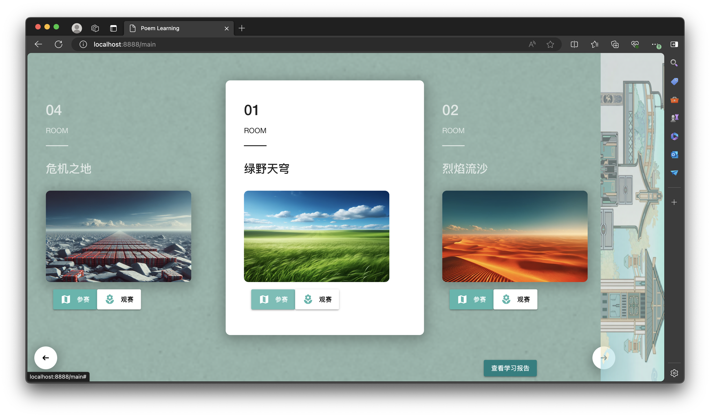
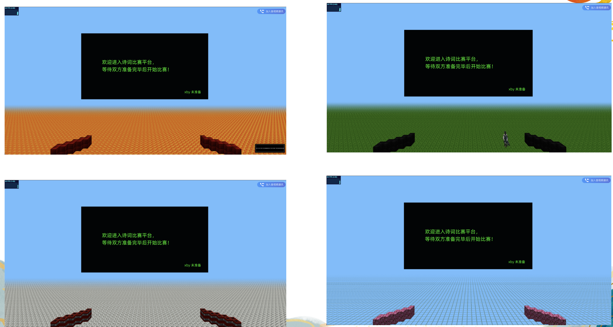

# 项目设计文档
## 1. 项目概述


## 2. 功能项表
| 功能项       | 评分指标                     | 完成情况 |
| --------- | ------------------------ | ---- |
| **基本功能**  |                          |      |
| UI和交互     | UI设计合理，具有较好的用户体验         | ✅    |
| 基本页面与流程   | 登录和注册功能使用正常              | ✅    |
|           | 后端用户管理功能                 | ✅    |
| 虚拟场景以及交互  | 可交互的3D场景建模合理，用户体验好       | ✅    |
|           | 场景功能的完成度和交互的丰富程度         | ✅    |
|           | 支持多人加入该场景，并实现行为共享        | ✅    |
|           | 支持用户间的文本、动作等方式交流         | ✅    |
| 工程能力      | 文档说明清晰、详细，图文并茂，图示准确      | ✅    |
|           | 系统架构设计合理规范               | ✅    |
|           | 代码清晰，风格合理，具有良好的设计模式      | ✅    |
|           | 服务部署在云平台上，具有很好的可访问性      | ✅    |
| **进阶功能**  |                          |      |
| AI能力      | 响应用户虚拟行为的智能导师            | ✅    |
| 语义Web         | 虚拟场景中的实体添加语义描述           | ✅    |
| 交互性       | 创新交互与多模式交流支持（如WebRTC）    | ✅    |
| 云计算应用 |  合理采用 Docker 以及多种云服务 | ✅    |
| 微服务    | 对项目进行微服务拆分        | ✅    |
| 用户个性化统计信息 | 多维度展现用户的学习情况，同时引入错题分析与推荐 | ✅    |
| 用户体验优化    | 进度条加载 | ✅    |
|		|不同人物的待机动作展示            | ✅    |
|		|设置不同的主题房间  |✅    |


## 3.  项目组织文件说明
```
.
├── poem-learning-platform  # 前端
└── poetryconference-parent # 后端
    ├── ai-chat-service
    ├── api-gateway
    ├── eureka-server
    ├── poem-service
    └── user-service
```
### 3.2 前端部分
```
├── App.vue
├── assets
│   ├── animation
│   ├── img
│   ├── model
│   ├── owl
│   └── textures
├── fonts
│   └── ali.json
├── main.js
├── quasar-variables.sass
├── router
│   └── index.js
├── scripts
│   ├── communications.js
│   ├── font.js
│   ├── loader.js
│   ├── physics.js
│   ├── player.js
│   ├── rng.js
│   ├── screen.js
│   ├── simplepeer.min.js
│   ├── socket.js
│   ├── ui.js
│   ├── webrtc.js
│   ├── world.js
│   └── worldChunk.js
├── store
│   └── index.js
└── views
    ├── LoginPage.vue
    ├── MainPage.vue
    ├── OpenView.vue
    ├── PersonPage.vue
    ├── ProgressBar.vue
    ├── RegisterPage.vue
    ├── audience.vue
    ├── scene.vue
    └── testPage.vue
```
### 3.3 后端部分

```
└── poetryconference-parent 
    ├── ai-chat-service 	# AI智能导师服务
    ├── api-gateway 		# API网关服务
    ├── eureka-server 		# 服务注册中心
    ├── poem-service 		# 诗歌服务
    └── user-service 		# 用户管理服务
```

## 4.  关键功能的实现细节
### 4.1 AI智能导师
#### 概述
#### 实现原理
### 4.2 语义描述
#### 概述
对于3D场景中的实体块，定义实体类别和属性，通过RDF/OWL语法将实体与其属性关联起来，生成语义描述，使AI能够理解和处理这些实体及其关系。
#### 实现原理
从指定路径加载OWL文件并解析其内容，提取RDF数据生成关系对象。具体过程如下：
1. **编写OWL文件：** 定义实体类别，属性以及之间的关系。
2. **加载和解析 OWL 文件：** 从指定路径加载 OWL 文件。使用 `fetch` API 获取文件内容，然后使用 RDFLib 库解析 RDF 数据。解析后的数据存储在一个三元组图中，方便后续处理。
3. **提取 RDF 数据：** 从 RDF 图中提取有用的信息，包括类定义、属性定义和实体关系。将这些信息分类存储在对象中：
	- **类定义**：记录每个类及其对应的类型。
	- **属性定义**：记录每个属性及其对应的类型和对象。
	- **实体关系**：记录实体之间的关系，包括主语、谓语和宾语。
4. **使用 Three.js 进行可视化：** 最后，我们利用提取的信息创建一个 Three.js 场景，展示实体之间的关系。例如，对于 `airWallBlock` 类，我们将其关系数据转换为 Three.js 的实例化网格对象，并将其用户数据设为提取的信息。
### 4.3 WebRTC
#### 概述
#### 实现原理
### 4.4 Docker及部署
#### 概述
使用 Docker 容器技术，将项目部署在云平台上，实现云端的可扩展性和弹性伸缩。
#### 实现原理
1. **Dockerfile 编写：** 编写 Dockerfile 文件，定义镜像的基础环境、安装依赖、添加应用文件等。

   这里仅展示mysql服务 Dockerfile的编写：

   ```yml
   # 使用官方 MySQL 镜像作为基础
   FROM mysql:8.0
   
   # 设置环境变量
   ENV MYSQL_ROOT_PASSWORD=123456
   ENV MYSQL_DATABASE=poetry
   
   # 拷贝初始化 SQL 脚本到容器中
   COPY ./init.sql /docker-entrypoint-initdb.d/
   
   # 公开端口 3306
   EXPOSE 3306
   ```

2. **镜像构建：** 使用 Docker 客户端构建镜像，生成 Docker 镜像。

   * 对于Spring Cloud 项目，采用IDEA插件一键构建：
     * 打开`IntelliJ IDEA`
     * `Maven` -> `$Project` -> `Plugins` -> `spring-boot` -> `spring-boot: build-image`
   * 对于数据库和前端服务，采用`docker build . -t`构建。

3. **在服务器上加载镜像: **将 Docker 镜像从本机环境传输到服务器环境。

   以user-service image的传输为例：

   ```shell
   docker save zsq0216/user-service:latest > user-service.tar # 保存docker镜像为tar文件
   scp user-service.tar root@121.196.228.112:/  # scp传输，将本机镜像传输到其他服务器
   docker load < user-service.tar  # 解压镜像
   ```

4. **运行docker容器：**通过 `docker-compose.yml` 文件，可以一次性启动多个服务，定义服务间的依赖关系、网络和存储卷等。

   * 创建 `docker-compose.yml` 文件：

     ```yml
     version: '3.8'
     
     services:
       my-local-mysql:
         image: zsq0216/my-local-mysql
         container_name: my-local-mysql
         restart: always
     
         ports:
           - "3308:3306"
         environment:
           MYSQL_ROOT_PASSWORD: 123456
           MYSQL_DATABASE: poetry
         networks:
           - my-network
     
       eureka-server:
         image: zsq0216/eureka-server
         container_name: eureka-server
         restart: always
         ports:
           - "8761:8761"
         networks:
           - my-network
     
       user-service:
         image: zsq0216/user-service
         container_name: user-service
         restart: always
         environment:
           SPRING_DATASOURCE_URL: jdbc:mysql://my-local-mysql:3306/poetry?serverTimezone=UTC
           SPRING_DATASOURCE_USERNAME: root
           SPRING_DATASOURCE_PASSWORD: 123456
           SPRING_DATASOURCE_DRIVERCLASSNAME: com.mysql.cj.jdbc.Driver
           EUREKA_CLIENT_SERVICEURL_DEFAULTZONE: http://eureka-server:8761/eureka/
           SPRING_JPA_HIBERNATE_DIALECT: org.hibernate.dialect.MySQLDialect  
         ports:
           - "8081:8081"
         networks:
           - my-network
         depends_on:
           - my-local-mysql
           - eureka-server
       
       poem-service:
         image: zsq0216/poem-service
         container_name: poem-service
         restart: always
         environment:
           SPRING_DATASOURCE_URL: jdbc:mysql://my-local-mysql:3306/poetry?serverTimezone=UTC
           SPRING_DATASOURCE_USERNAME: root
           SPRING_DATASOURCE_PASSWORD: 123456
           SPRING_DATASOURCE_DRIVERCLASSNAME: com.mysql.cj.jdbc.Driver
           EUREKA_CLIENT_SERVICEURL_DEFAULTZONE: http://eureka-server:8761/eureka/
           SPRING_JPA_HIBERNATE_DIALECT: org.hibernate.dialect.MySQLDialect  
         ports:
           - "8082:8082"  
         networks:
           - my-network
         depends_on:
           - my-local-mysql
           - eureka-server
     
       ai-chat-service:
         image: zsq0216/ai-chat-service
         container_name: ai-chat-service
         restart: always
         environment:
           EUREKA_CLIENT_SERVICEURL_DEFAULTZONE: http://eureka-server:8761/eureka/
         ports:
           - "8085:8085"
         networks:
           - my-network
         depends_on:
           - eureka-server
     
       api-gateway:
         image: zsq0216/api-gateway
         container_name: api-gateway
         restart: always
         environment:
           EUREKA_CLIENT_SERVICEURL_DEFAULTZONE: http://eureka-server:8761/eureka/
         ports:
           - "2345:2345"
         networks:
           - my-network
         depends_on:
           - eureka-server
     
     networks:
       my-network:
         driver: bridge
     ```

   * 运行 Docker Compose：

     ```shell
     # 运行
     docker-compose up -d
     
     # 查看容器状态
     docker-compose ps
     
     # 结束运行
     docker-compose down -v
     ```

### 4.5 微服务系统架构设计

### 4.6 用户个性化统计信息
#### 概述
#### 实现原理
### 4.7 进度条

### 4.8 模型优化

### 4.9 主题房间
#### 概述
对不同的对战房间（3D）进行各具特色的场景布置，同时为每个房间设置对应的2D概念图和名称，为用户带来多样化的体验。


#### 实现原理
利用 AI 图像生成技术生成 2D 概念图，并运用开源的 Minecraft 贴图模型进行搭配上的选择，构建不同风格的 3D 场景。

### 4.10 UI设计与交互

### 4.11 选手交互

### 4.12 用户交互

### 4.13 代码风格与设计模式


